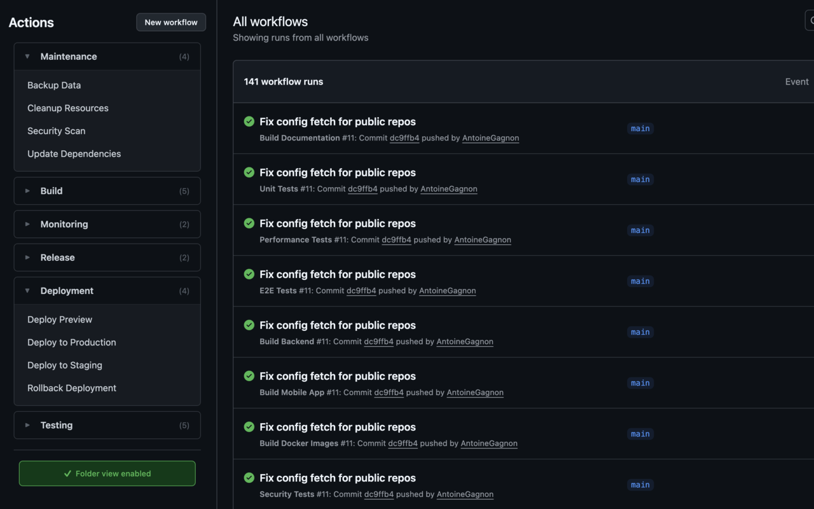

# GitHub Actions Folder Organizer

[](https://github.com/Kurigi/github-folders/releases)
[](LICENSE)
[](https://chromewebstore.google.com/detail/github-actions-folder-org/cjaleaniaichaneokpblfjnafkcahcjo)
[](https://github.com/Kurigi/github-folders)

Organize your GitHub Actions workflows into custom folders for better project organization. Works seamlessly with GitHub's interface and supports both public and private repositories.

**Cross-browser compatible:** Available for Chrome, Firefox, and other Chromium-based browsers.



## Features

- 📁 **Custom folder organization** - Group workflows however you want
- 🎨 **Native GitHub styling** - Matches GitHub's design perfectly
- 🔒 **Private repo support** - Works with both public and private repositories
- ⚡ **Optional API token** - Better rate limits and more reliable for heavy usage
- 🌓 **Dark mode** - Looks great in both light and dark themes
- 🎛️ **Per-repo toggle** - Enable/disable for each repository independently
- 💾 **Folder state memory** - Remembers which folders are expanded/collapsed
- 🔧 **Easy config creation** - One-click button to create config file

## Installation

### From Browser Stores

**Chrome / Edge / Brave:**
Install from the [Chrome Web Store](https://chromewebstore.google.com/detail/github-actions-folder-org/cjaleaniaichaneokpblfjnafkcahcjo)

**Firefox:**
Coming soon to Firefox Add-ons (submitted for review)

### Load Locally

**Chrome / Chromium-based:**
1. Download the latest release from [GitHub Releases](https://github.com/Kurigi/github-folders/releases)
2. Extract the Chrome ZIP file
3. Open your browser and go to `chrome://extensions/` (or `edge://extensions/`)
4. Enable **Developer mode** (toggle in top right)
5. Click **Load unpacked** and select the extracted directory
6. Visit any GitHub Actions page to see it in action!

**Firefox:**
1. Download the latest release from [GitHub Releases](https://github.com/Kurigi/github-folders/releases)
2. Extract the Firefox ZIP file
3. Open Firefox and go to `about:debugging#/runtime/this-firefox`
4. Click **Load Temporary Add-on**
5. Select the `manifest.json` file from the extracted directory
6. Visit any GitHub Actions page to see it in action!

## Quick Start

### Option 1: Use the Extension Button

1. Visit your repository's Actions page
2. If you have write access, you'll see a **"Create Config File"** button
3. Click it to create a template config file with example folders
4. Edit the file to organize your workflows

### Option 2: Create Manually

Create a file at `.github/actions-folders.json` in your repository:

```json
{
  "folders": [
    {
      "name": "Build & Test",
      "workflows": ["ci.yml", "test.yml"]
    },
    {
      "name": "Deployment",
      "workflows": ["deploy-prod.yml", "deploy-staging.yml"]
    }
  ]
}
```

That's it! Visit your repository's Actions page and your workflows will be organized into folders.

**Notes:**
- Use just the workflow filename (e.g., `ci.yml`), not the full path
- Workflows not in any folder will appear in "Uncategorized"
- Click folder headers to expand/collapse them
- Use the toggle button (bottom of sidebar) to enable/disable per repository

## Optional: GitHub API Token

The extension works without a token, but adding one gives you better rate limits (5,000/hour vs 60/hour) and more reliable performance for private repositories.

**To add a token:** Click the extension icon → "Open Settings" → follow the instructions in the options page.

## Example

See it in action: [GitHub Folders Actions](https://github.com/Kurigi/github-folders/actions)

## Troubleshooting

**Extension not working?**
- Make sure you're on a GitHub Actions page (`github.com/*/actions`)
- Check that `.github/actions-folders.json` exists in your repository
- Verify the JSON syntax is valid

**Config not loading?**
- File must be on your default branch (`main` or `master`)
- For private repos, make sure you're logged into GitHub
- Try clearing the cache: Click extension icon → "Open Settings" → "Clear All Cache"

**Workflows not showing in folders?**
- Workflow filenames are case-sensitive
- Make sure filenames match exactly with your `.github/workflows/` files

## Options & Settings

Click the extension icon and select **"Open Settings"** to:
- Add an optional GitHub API token for better performance
- View all repositories with saved folder states
- Clear folder states for specific repositories
- Clear all cached config files

## Privacy & Security

- ✅ Only runs on GitHub Actions pages
- ✅ No data sent to external servers
- ✅ Optional API token (stored securely in Chrome's encrypted storage)
- ✅ Config files cached locally in your browser
- ✅ All data stays local - nothing sent to third parties
- ✅ Open source - inspect the code yourself

## Contributing

Contributions are welcome! Please feel free to submit issues or pull requests.

For development setup and architecture details, see [CLAUDE.md](./CLAUDE.md).

## License

GPL v3 License - See [LICENSE](./LICENSE) file for details.

---

Built with ❤️ for better GitHub Actions organization
